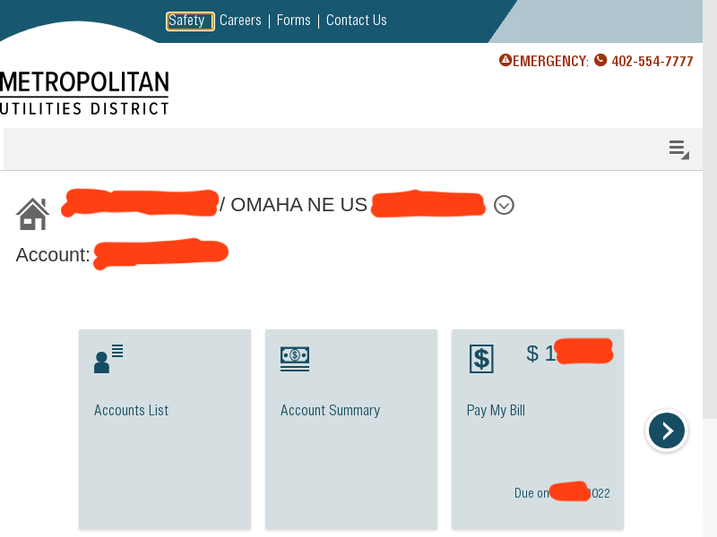
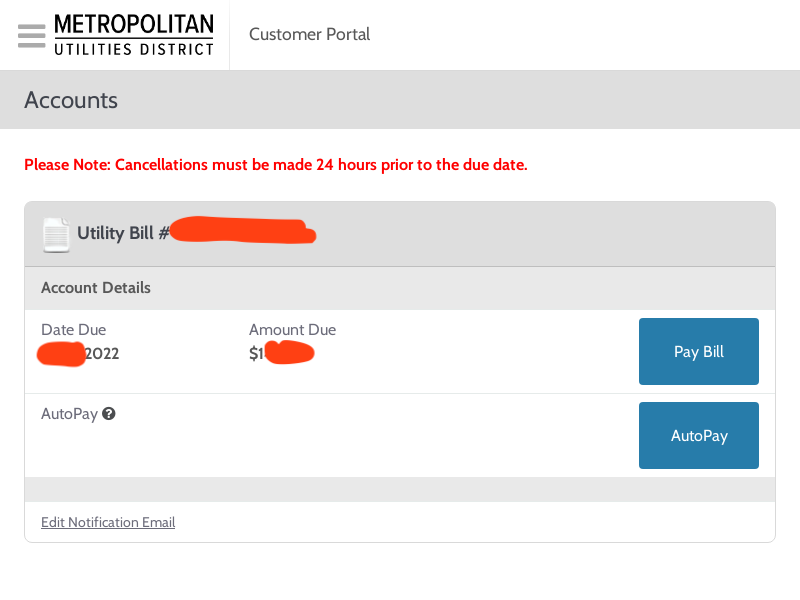
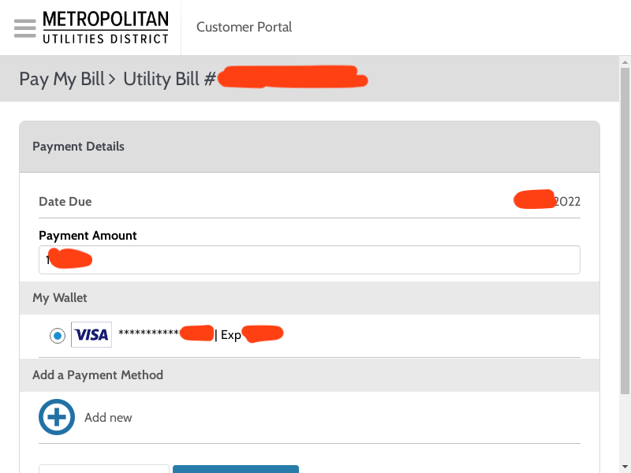
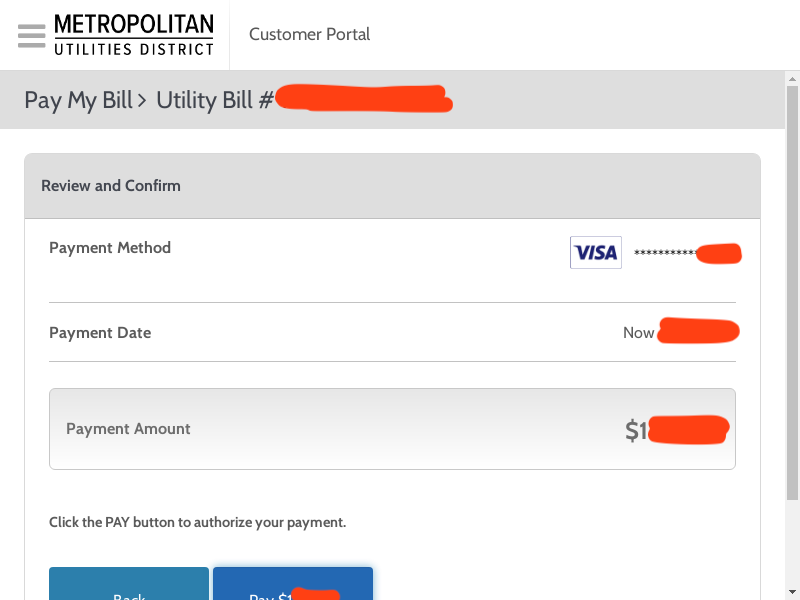
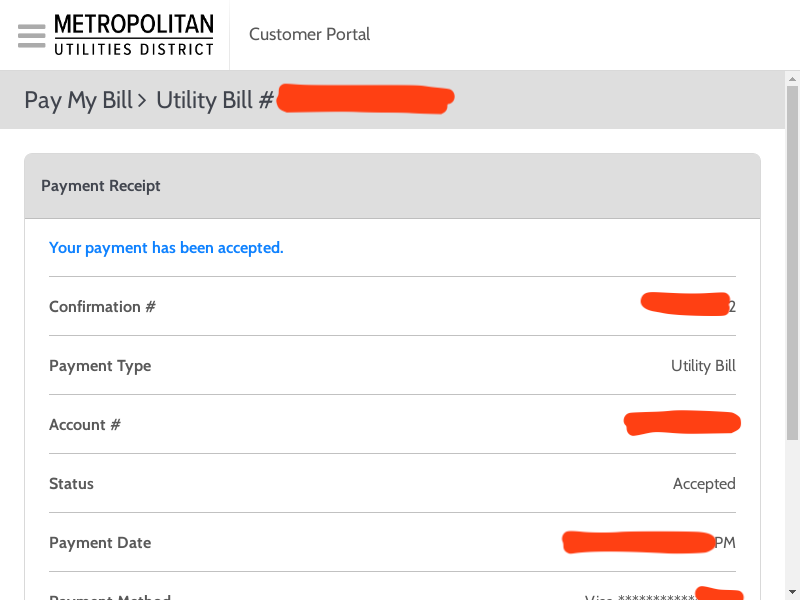

# MUD Omaha Auto Credit Card Pay

This is a Java project that uses Selenium, chromedriver, and Gmail to pay an MUD Omaha bill using the credit card saved in the account's wallet.

---
## Prerequisites
- Java 11
- chromedriver
- A Gmail account for sending alerts
---

## Usage
`java -cp MudOmahaAutoCreditCardPay-1.0-SNAPSHOT-jar-with-dependencies.jar io.skylerlewis.billpay.mudomaha.MudOmahaBillPayer <MUD_OMAHA_ACCOUNT_EMAIL> <MUD_OMAHA_ACCOUNT_PASSWORD> <GMAIL_ADDRESS_FOR_SENDING_ALERTS> <GMAIL_PASSWORD_FOR_SENDING_ALERTS> <EMAIL_ADDRESS_FOR_RECEIVING_ALERTS>`

## Example
The example below would:
1. Sign into mudomaha.com using the john.smith@example.com account
2. If the bill due is $0, stop the program
3. If the bill due is greater than $0, pay the amount due using the credit card saved in the account's wallet
4. Send a picture message to 123-456-7890 (on Verizon) with screenshots showing the bill has been paid, including the payment confirmation number

`java -cp MudOmahaAutoCreditCardPay-1.0-SNAPSHOT-jar-with-dependencies.jar io.skylerlewis.billpay.mudomaha.MudOmahaBillPayer john.smith@example.com jOhNsMiThPaSsWoRd mud-omaha-bill-alert123@gmail.com GmAiLpAsSwOrD 1234567890@vzwpix.com`

---
## Sample Screenshots

